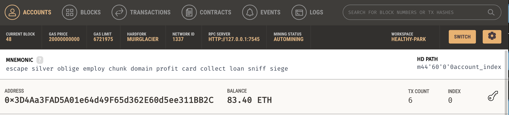
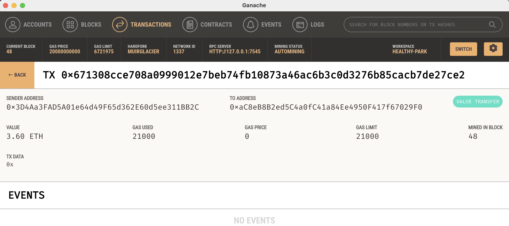
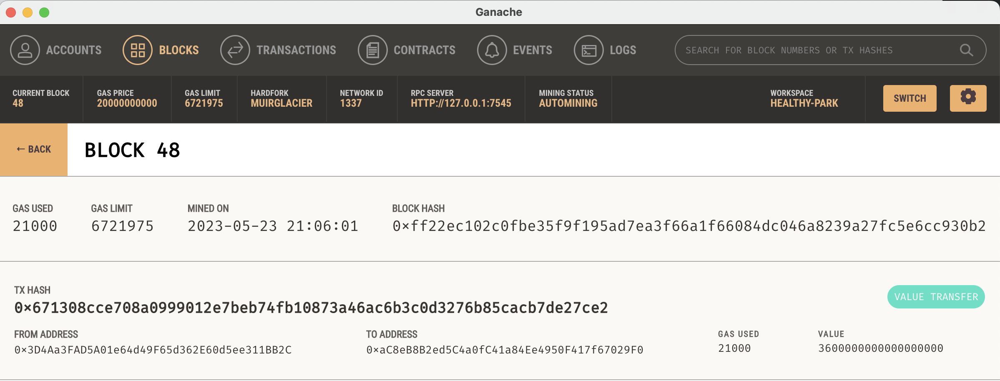

# Building a Blockchain-based Ledger System

This project is designed to enables customers to send cryptocurrency payments to fintech professionals.

## Technologies

The project uses the following technologies:

This project was created using the following technologies:

- Python programming language (version 3.9.7)
- Streamlit (version 1.20.0) for building the user interface
- pandas library (version 1.5.3) for data manipulation and analysis
- web3(version 5.17)
- Ganache(version 2.7.1)


## Installation Guide

1. Clone the repository from GitHub:

    ```
    git clone https://github.com/Demigodgeek/C19_cryptocurrency_wallet.git
    ```

2. Install the required Python libraries:
conda create -n env_whatever_name python=3.8 (i.e. any python version above 3.7.1)
conda activae env_whatever_name
pip install streamlit
pip install web3==5.17
pip install eth-tester==0.5.0b3
pip install mnemonic
pip install bip44

## Usage

To use the PyChain ledger, follow these steps:

1. In the terminal, navigate to the project folder `C19_cryptocurrency_wallet`
2. In the terminal, run the Streamlit application by using `streamlit run streamlit.py`.
3. On the resulting webpage, select a candidate that you would like to hire from the appropriate drop-down menu. Then, enter the number of hours that you would like to hire them for. (Remember, you do not have a lot of ether in your account, so you cannot hire them for long!)
4. Click the Send Transaction button to sign and send the transaction with your Ethereum account information. If the transaction is successfully communicated to Ganache, validated, and added to a block, a resulting transaction hash code will be written to the Streamlit
application sidebar.
Here is the image that shows you executing a payment transaction from your app displaying the returned transaction hash. 

4. After the transaction, the account tab with address balance and tx account looks as this,  

5. The transaction tab has a transaction list, click the transaction we just made, the tag shows the detail of this transaction,

The Block tab has a block list, click the block we just made, the tag shows the history of this transaction

## Contributors

- Demi Gao

## License

This project is licensed under the [MIT License](https://opensource.org/licenses/MIT).